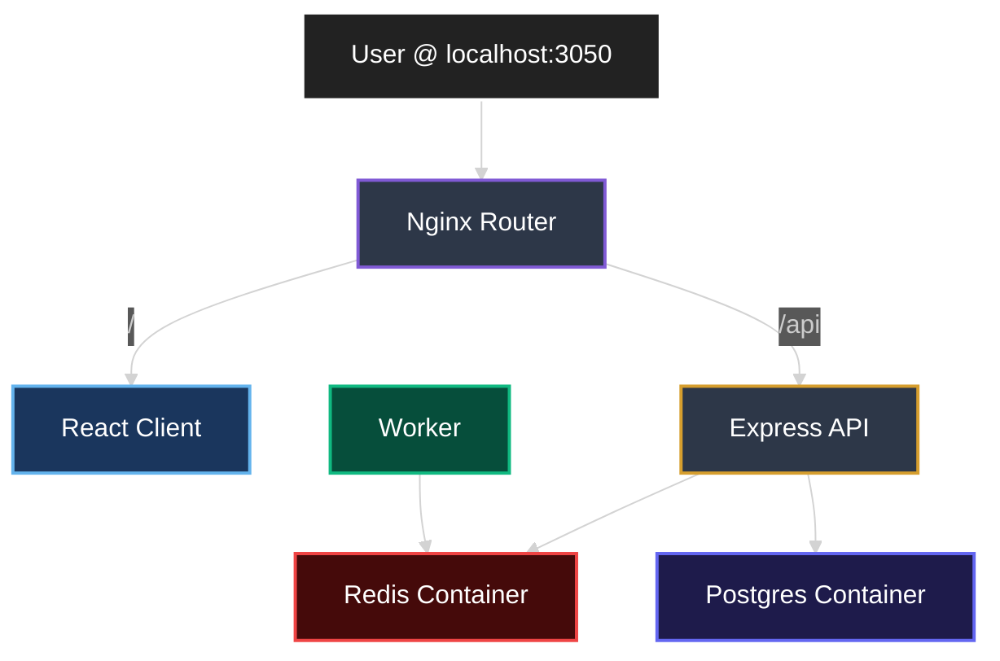
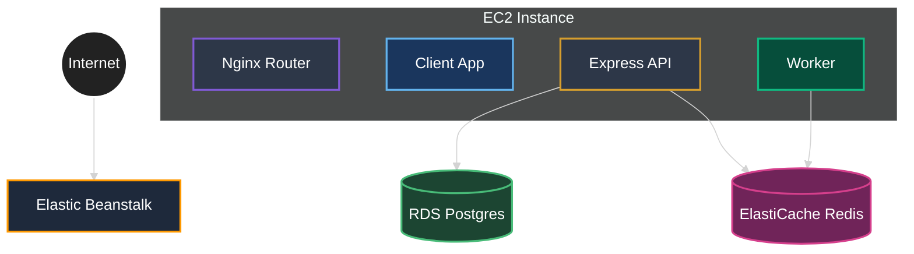
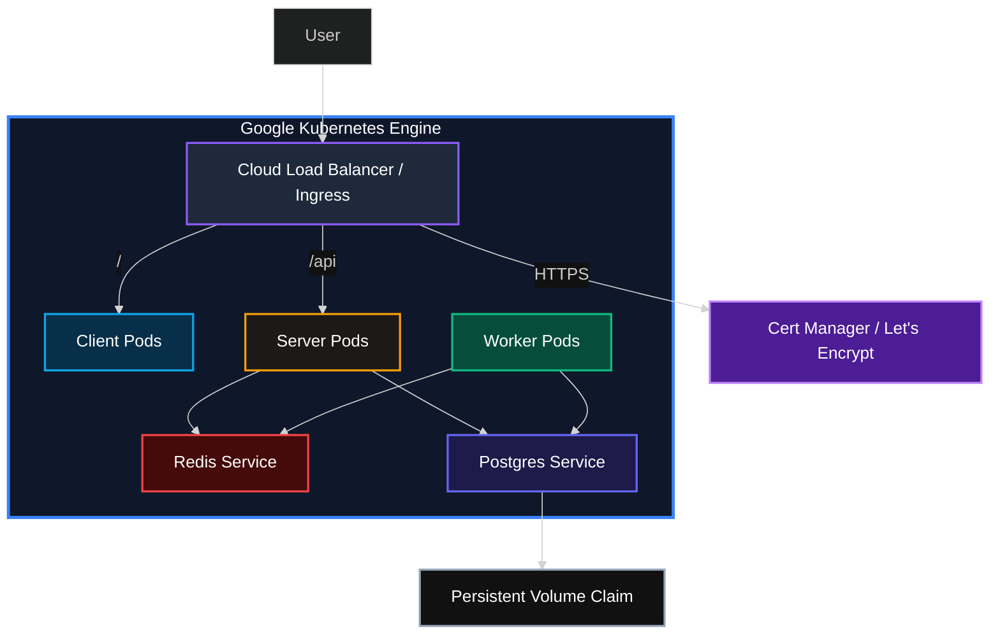

# ComputeHub Evolution & Architecture

ComputeHub is a multi-container microservices platform that has evolved through three distinct architectural stages: Local Development, AWS Elastic Beanstalk (Legacy), and Google Kubernetes Engine (Production).

---

## 1. Local Development (Docker Compose)

The foundation of the project uses **Docker Compose** for a reproducible developer environment.

- **Orchestration**: `docker-compose-dev.yml`
- **Networking**: A private Docker bridge network.
- **Routing**: A dedicated Nginx container acts as a reverse proxy, exposing the app on `localhost:3050`.
- **Infrastructure**: Redis and Postgres run as local containers within the same bridge network.
- **Developer Flow**: Source code is volume-mapped to containers for hot-reloading.

---

## 2. Legacy Deployment (AWS Elastic Beanstalk)

The first production iteration used **AWS Elastic Beanstalk** (Generic Docker platform) to run the composite application.

- **Deployment Model**: Multi-container Docker on a single EC2 instance.
- **Managed Services**: Migration of stateful services to cloud-managed equivalents:
    - **RDS (Postgres)** replaced the local container.
    - **ElastiCache (Redis OSS)** replaced the local Redis container.
- **Routing**: Still relied on the custom `nginx` container within the compose file for path-based routing.
- **Scaling**: Scaling was limited to vertical scaling of the EC2 instance or crude Load Balancer horizontal scaling of the entire compose stack.

---

## 3. The Conceptual Shift: Docker Compose to Kubernetes

Moving from a single-node Compose setup to a multi-node Kubernetes cluster required a fundamental shift in how resources are defined and managed.

### Resource Mapping

| Docker Compose | Kubernetes Equivalent | Purpose |
| :--- | :--- | :--- |
| `services` | `Deployments` / `Pods` | The actual running containers. |
| `ports` (internal) | `ClusterIP Service` | Internal networking/load balancing between pods. |
| `nginx` service | `Ingress` / `LoadBalancer` | External entry point and path-based routing. |
| `volumes` | `PersistentVolumeClaim` (PVC) | Persistent storage that survives pod restarts. |
| `environment` | `ConfigMap` / `Secret` | Decoupled configuration and sensitive data. |
| `depends_on` | `Init Containers` / Retries | Handling startup dependencies. |

### Key Differences in Architecture

1.  **Networking**: In Compose, all containers share a single bridge network. In K8s, pods have individual IPs, and a **Service** object is required to provide a stable DNS name and load balancing for those pods.
2.  **Scalability**: Compose is typically limited to a single host. Kubernetes can span hundreds of nodes, using the **Scheduler** to decide where to place pods based on CPU/RAM availability.
3.  **Self-Healing**: While Docker can restart containers, Kubernetes goes further by recreating pods on healthy nodes if a physical server fails.
4.  **Routing**: Instead of maintaining a custom `nginx.conf`, we use an **Ingress Controller**. This allows us to define high-level routing rules that the Cloud Load Balancer implements automatically.

---

## 4. Production Architecture (Google Kubernetes Engine)

The current state-of-the-art architecture moves from composite containers to true container orchestration using **GKE**.

### Architectural Shifts
1. **From Container-Nginx to Ingress**: The custom Nginx container is replaced by a **Cloud Load Balancer (Ingress)** managed by GKE.
2. **From Single EC2 to Cluster**: Services are now independent **Pods**, allowing for independent scaling of the Client, Server, and Worker.
3. **Automated Security**: Integration with **Cert-Manager** and **Let's Encrypt** for automated HTTPS termination at the Ingress level.
4. **Volume Management**: Uses **Persistent Volume Claims (PVC)** for persistent storage of transaction logs.

### GKE Topology

---

## Service Roles & Data Flow

Regardless of the environment, the logical flow of data remains consistent:

1. **Frontend (React)**: User enters a Fibonacci index.
2. **Express API**: 
    - Saves the index to **Postgres** (History).
    - Writes a placeholder string to **Redis**.
    - Publishes an `insert` event to Redis.
3. **Worker (Node.js)**:
    - Listens for the `insert` event.
    - Computes the Fibonacci value.
    - Updates the result in **Redis**.
4. **Polling**: The Frontend polls the API, which reads the calculated value from the Redis cache.

## Summary of Platform Transition

| Feature | Local Dev | AWS Beanstalk | GKE (Production) |
| :--- | :--- | :--- | :--- |
| **Orchestration** | Docker Compose | Multi-Container Docker | Kubernetes (GKE) |
| **Routing** | Container Nginx | Container Nginx | Cloud Load Balancer (Ingress) |
| **Scaling** | Manual | Instance-based | Pod-based (HPA) |
| **HTTPS** | None | ALB Termination (Manual) | Cert-Manager (Automated) |
| **Persistence** | Local Vol | RDS | Persistent Volume Claim (PVC) |
