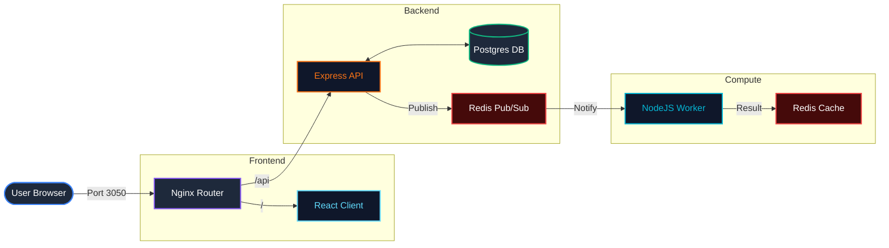

# System Architecture Design

ComputeHub follows a distributed microservices pattern, utilizing several industry-standard technologies to manage data flow and task processing.

## 📊 Data Flow Diagram

## 🧩 Component Roles

### 1. Nginx Gateway
Acts as a Reverse Proxy. It is the single entry point for all traffic.
- Routes `/` requests to the **React Client**.
- Routes `/ws` requests (WebSockets) to the **React Client** for hot-reloading.
- Routes `/api` requests to the **Express API** (after stripping the `/api` prefix).

### 2. Express API
The orchestrator of the system.
- Receives numeric indexes for Fibonacci calculation.
- Stores the request metadata in **PostgreSQL**.
- Stores a temporary "Nothing yet!" placeholder in **Redis**.
- Publishes an "insert" event to Redis to notify the Worker.

### 3. Redis (Cache & Message Broker)
Handles the asynchronous communication.
- **Pub/Sub**: Facilitates the "fire and forget" communication between API and Worker.
- **Cache**: Stores the final results of calculations, allowing for O(1) retrieval speed.

### 4. Background Compute Worker
A standalone Node.js process dedicated to logic execution.
- Subscribed to Redis "insert" events.
- Performs the actual Fibonacci calculation (recursive logic).
- Stores the final result back in the Redis cache.

### 5. PostgreSQL
Responsible for persistent, tabular data storage. 
- Keeps a permanent record of all indexes that have ever been requested by users.

## 🧠 Core Design Rationale

The architecture of ComputeHub is built on three fundamental engineering principles:

### 1. Persistent Audit vs. Volatile Cache
The system separates data based on its importance and access frequency:
- **PostgreSQL (Audit Log)**: Stores the user's input (the "Question") permanently. This acts as a reliable source of truth and an audit trail that survives container restarts or system crashes.
- **Redis (Result Cache)**: Stores the computed values (the "Answer"). Since Fibonacci results are expensive to calculate but never change for a given index, they are cached in Redis for O(1) retrieval speed.

### 2. Event-Driven Decoupling
Rather than using a synchronous request-response cycle for heavy calculations, the system uses **Redis Pub/Sub**:
- **Non-blocking API**: The API receives a request, logs the intent in Postgres, and "hands off" the task to Redis. It then immediately responds to the user, ensuring the web interface remains responsive.
- **Resource Isolation**: The Worker process is completely decoupled. It can be scaled independently or even paused for maintenance without crashing the API or losing user requests.

### 3. Segregation of Responsibility
This architecture demonstrates clear **Separation of Concerns**:
- **The API** only handles validation, routing, and primary logging.
- **The Worker** only handles computational logic.
- **The Database** only handles permanent records.
- **The Cache** handles high-speed result distribution.

## 🚀 Scalability Considerations

- **Stateless API**: Multiple instances of the API can be started behind the Nginx load balancer.
- **Horizontal Worker Scaling**: Since workers are decoupled via Redis, we can spin up 10+ worker containers to handle heavy computational loads without affecting the API's responsiveness.
- **Dedicated Persistence**: Separating the cache (Redis) from the permanent store (Postgres) ensures high-speed data access for common requests while maintaining data integrity.
