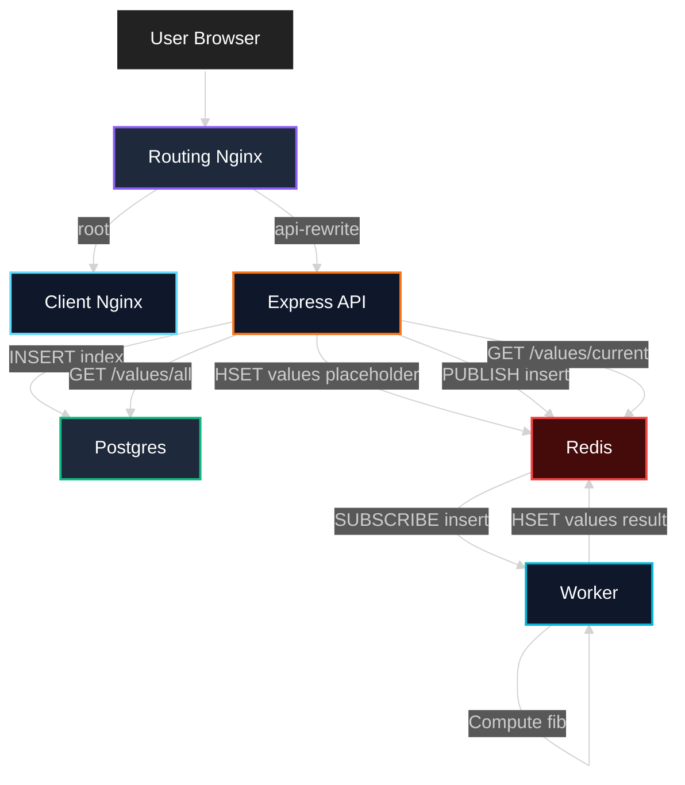
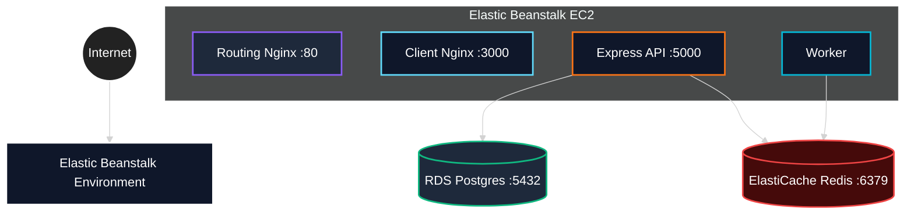

# System Architecture Design

ComputeHub is a multi-container microservices demo with:

- **Routing Nginx** as a single entry point
- A **React client** (served by its own Nginx in production)
- An **Express API**
- A **worker** process for asynchronous computation
- **Postgres** for persistence (history/audit log)
- **Redis** for pub/sub + caching computed results

This doc aligns with the project workflow:

- **Local dev**: `docker-compose-dev.yml` (Redis+Postgres run as containers, app exposed on `localhost:3050`)
- **Production (AWS)**: `docker-compose.yml` (pulls images from Docker Hub, uses RDS + ElastiCache)

## Data flow (logical)

## Deployment topology

### Local development (Docker Compose)

- `nginx` exposes the app on **`localhost:3050`**
- `postgres` and `redis` are local containers
- `client`, `api`, and `worker` mount source code for hot reload (see `docker-compose-dev.yml`)

### AWS (Elastic Beanstalk + managed services)

- `docker-compose.yml` (production) runs **4 containers on the Beanstalk EC2 instance**:
  - `nginx` (router)
  - `client` (static build served by Nginx on port 3000 internally)
  - `api`
  - `worker`
- Postgres runs on **RDS**
- Redis runs on **ElastiCache (Redis OSS)**

## Component roles (what each service does)

### Routing Nginx (`nginx`)

- Routes `/` to the client container (static assets)
- Routes `/api/*` to the API container after stripping `/api`
- In development, also forwards `/ws` for the React dev server websocket

### Express API (`server`)

- Validates indexes (caps at 40)
- Writes “history” to Postgres
- Writes a placeholder (“Nothing yet!”) to Redis for immediate UI feedback
- Publishes an `insert` event to Redis so the worker can compute the result

### Worker (`worker`)

- Subscribes to Redis channel `insert`
- Computes Fibonacci value
- Stores results back into Redis hash `values`

### Redis (dev: container, prod: ElastiCache)

- Pub/Sub event bus between API and Worker
- Cache of computed results (`HSET values <index> <result>`)

### Postgres (dev: container, prod: RDS)

- Persistent audit log of submitted indexes

## Operational notes (AWS)

- **Security groups**: Beanstalk ↔ RDS ↔ ElastiCache communication is controlled by SG rules.
  - Allow `5432` (Postgres) and `6379` (Redis) with **source = same SG**.
- **ElastiCache transit encryption**: set to **Preferred** (this repo’s Redis client does not use TLS).
