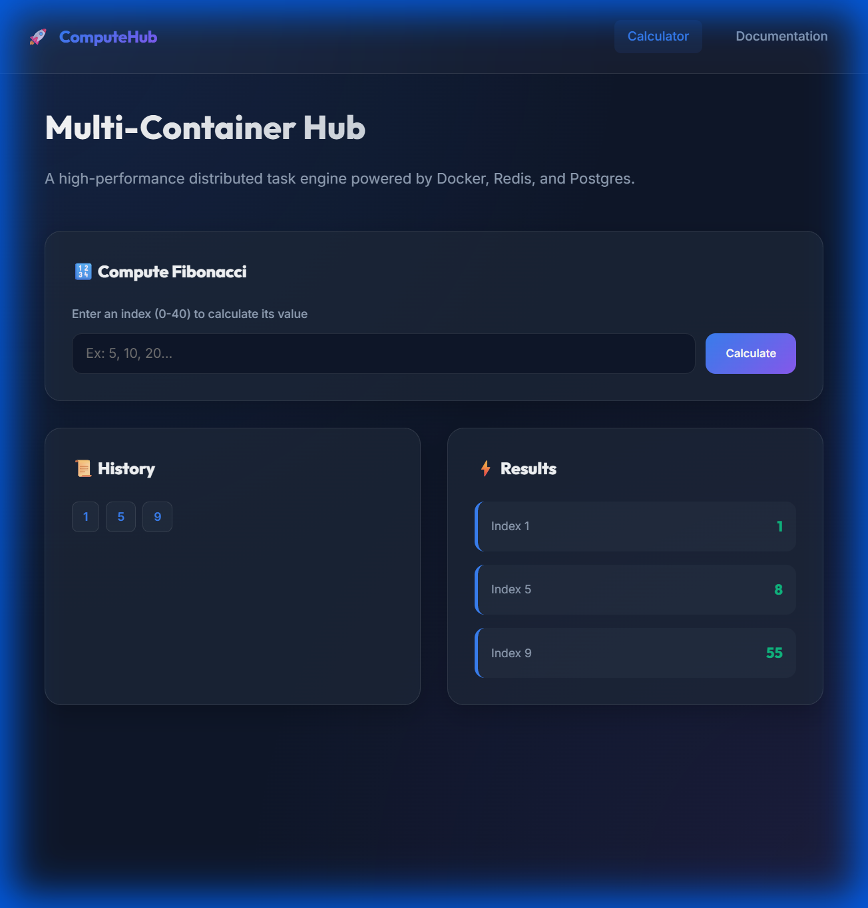

# ComputeHub | Multi-Container Hub


## ✨ Preview



A high-performance, distributed system architecture for processing computational tasks at scale. ComputeHub demonstrates how to orchestrate a full-stack microservices environment using Docker, Redis for event-driven coordination, and Nginx for intelligent routing.

## Services

| Service | Docker Hub Image | Description |
| :--- | :--- | :--- |
| **Client** | [`vikas9dev/computehub-client`](https://hub.docker.com/r/vikas9dev/computehub-client) | Frontend React Application (Nginx-served) |
| **Server** | [`vikas9dev/computehub-server`](https://hub.docker.com/r/vikas9dev/computehub-server) | Backend Express API & Traffic Handler |
| **Worker** | [`vikas9dev/computehub-worker`](https://hub.docker.com/r/vikas9dev/computehub-worker) | Background Task Processor (Fibonacci) |
| **Nginx** | [`vikas9dev/computehub-nginx`](https://hub.docker.com/r/vikas9dev/computehub-nginx) | Primary Routing & Reverse Proxy |

## 🏗️ Architecture Overview

The system is built on a resilient, multi-container architecture designed for scalability and performance:

- **Frontend (React)**: Modern dashboard with a glassmorphism design.
- **API Gateway (Nginx)**: Handles routing between client assets and backend services.
- **Backend API (Express)**: Manages incoming requests and validates tasks.
- **Message Broker (Redis)**: Uses Pub/Sub to trigger background workers.
- **Compute Worker (Node.js)**: Dedicated service for heavy computational logic.
- **Data Persistence (Postgres)**: Final storage for completed task history.

Detailed architecture information can be found in [ARCHITECTURE.md](https://github.com/vikas9dev/multi-container-compute-hub/blob/main/ARCHITECTURE.md).

## ⚡ Quick Start

### Prerequisites
- [Docker Desktop](https://www.docker.com/products/docker-desktop/) installed on your machine.

### Run in Development
1. Clone the repository:
   ```bash
   git clone https://github.com/vikas9dev/multi-container-compute-hub.git
   cd multi-container-compute-hub
   ```
2. Start the orchestration with Docker Compose:
   ```bash
   docker compose up --build
   ```
3. Access the dashboard:
   👉 **http://localhost:3000**

## 🔧 Features
- **Event-Driven Workflow**: Real-time task queuing via Redis.
- **Scalable Workers**: Add more compute power by scaling the worker service.
- **Hot-Reloading Environment**: Seamless development with volume-mapped containers.
- **Resilient Infrastructure**: Automatic service restarts and robust error handling.
- **CI/CD Pipeline**: Fully automated testing and deployment workflow using GitHub Actions.

## 🛠️ Developed with
- **Docker & Docker Compose** (Orchestration)
- **Nginx** (Reverse Proxy & Routing)
- **Redis** (In-memory Cache & Pub/Sub)
- **PostgreSQL** (Relational Database)
- **Node.js / Express** (RESTful API)
- **React** (Modern UI Hooks & Component Architecture)
- **GitHub Actions** (CI/CD Automation)

---
