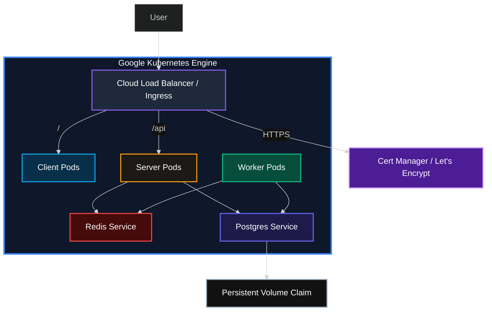
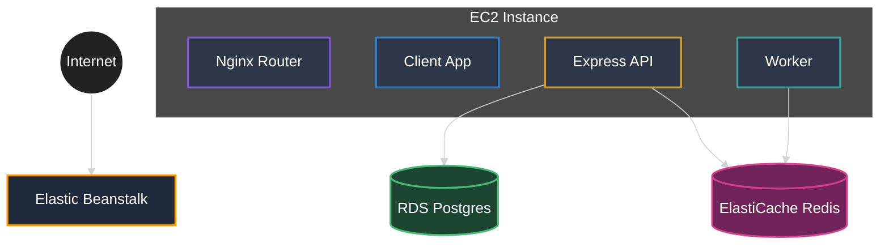

# ComputeHub | Multi-Container Hub


## ✨ Live Demo

> 🌐 **Live Site:** [https://computehub-k8s.vikas9dev.xyz/](https://computehub-k8s.vikas9dev.xyz/ )  
> 📁 **Source Code:** [https://github.com/vikas9dev/multi-container-compute-hub](https://github.com/vikas9dev/multi-container-compute-hub)  
> *(Note: The live site is part of a production deployment demonstration and may be taken down periodically to optimize compute costs.)*


A high-performance, distributed system architecture for processing computational tasks at scale. ComputeHub demonstrates how to orchestrate a full-stack microservices environment using **Kubernetes**, **Redis** for event-driven coordination, and a **Cloud Load Balancer (Ingress)** for intelligent routing.

## 🏗️ Kubernetes Architecture (Production)

This project is optimized for production-grade orchestration using **Google Kubernetes Engine (GKE)**. For a detailed breakdown of the system's evolution and design decisions, see the [Architecture Documentation](ARCHITECTURE.md).



### Key Kubernetes Features:
- **Cloud Load Balancer (Ingress)**: Unified entry point with automated traffic routing and path-based rules.
- **Cert-Manager**: Automated SSL/TLS certificate issuance via Let's Encrypt.
- **Scalability**: Decoupled client, server, and worker pods for independent scaling.
- **Durability**: Persistent Volume Claims (PVC) ensure database state is preserved across pod restarts.
- **CI/CD**: Fully automated deployment to GKE via GitHub Actions (`gke-pipeline.yml`).

## ☸️ GKE Deployment Flow
1. **GitHub Actions**: Builds Docker images and pushes to Docker Hub.
2. **Kubernetes Manifests**: Applied to the cluster from the `k8s/` directory.
3. **Ingress**: Triggers Cert-Manager to solve ACME challenges and secure the domain `computehub-k8s.vikas9dev.xyz`.

---

## ⚡ Quick Start (Local Development)

### Prerequisites
- [Docker Desktop](https://www.docker.com/products/docker-desktop/) with Kubernetes enabled (optional) or just Docker Compose.

### Run with Docker Compose
1. Clone the repository:
   ```bash
   git clone https://github.com/vikas9dev/multi-container-compute-hub.git
   cd multi-container-compute-hub
   ```
2. Start the orchestration:
   ```bash
   docker compose up --build
   ```
3. Access the dashboard: 👉 **http://localhost:3000**

---

## 🏘️ Multi-Container Services

| Service | Docker Hub Image | Description |
| :--- | :--- | :--- |
| **Client** | [`vikas9dev/computehub-client`](https://hub.docker.com/r/vikas9dev/computehub-client) | Frontend React Application (Nginx-served) |
| **Server** | [`vikas9dev/computehub-server`](https://hub.docker.com/r/vikas9dev/computehub-server) | Backend Express API & Traffic Handler |
| **Worker** | [`vikas9dev/computehub-worker`](https://hub.docker.com/r/vikas9dev/computehub-worker) | Background Task Processor (Fibonacci) |
| **Nginx** | [`vikas9dev/computehub-nginx`](https://hub.docker.com/r/vikas9dev/computehub-nginx) | Primary Routing (Local Dev / Docker Compose only) |

---

## ☁️ Legacy / Alternative Deployment (Elastic Beanstalk)

Prior to the Kubernetes migration, this project was deployed to **AWS Elastic Beanstalk** using a multi-container Docker setup.

### AWS Topology (Non-K8s)


*Note: The AWS deployment used external managed services (RDS/ElastiCache) while the Kubernetes version currently handles services within the cluster for demonstration purposes.*

---

## 🔧 Core Features
- **Event-Driven Workflow**: Real-time task queuing via Redis Pub/Sub.
- **Scalable Workers**: Add more compute power by scaling the worker service independently.
- **CI/CD Pipeline**: Fully automated testing and deployment workflow using GitHub Actions.
- **Automated HTTPS**: Production-grade security with Let's Encrypt integration.

## 🛠️ Developed with
- **Kubernetes & GKE** (Orchestration)
- **Docker & Docker Compose** (Containerization)
- **Nginx** (Reverse Proxy & Ingress)
- **Redis** (In-memory Message Broker)
- **PostgreSQL** (Relational Data Storage)
- **React / Express / Node.js** (Full-Stack Logic)

---
